# ML-Powered AWS EC2 Node Selection for Jenkins CI/CD

## 🎯 The Goal: Smart AWS Node Selection

Based on your infrastructure, you have **6 different AWS EC2 instance configurations**:

| Instance Type | Memory | Jenkins Label | Use Case |
|--------------|--------|---------------|----------|
| T3a Small | 1 GB | `lightweight` | Very light jobs, scheduling |
| T3a Small | 2 GB | `linux`, `executor` | Light jobs |
| T3a Large | 8 GB | `build`, `deploy` | General builds, releases |
| T3a X Large | 16 GB | `security`, `fortify`, `sourceclear` | Security scans |
| T3a X Large | 16 GB | `test` | Testing |
| T3a 2X Large | 32 GB | `heavytest` | Heavy testing workloads |

**Current Problem:** Developers manually choose labels, often picking oversized instances.

**ML Solution:** Predict the optimal label based on code changes → **Right-sized instances!**

---

## Part 1: How It Works - The Complete Flow

### 1.1 High-Level Architecture

```mermaid
flowchart TB
    subgraph Developer["👨‍💻 Developer"]
        D1[Push Code]
    end
    
    subgraph Jenkins["🔧 Jenkins Server"]
        J1[Pipeline Triggered]
        J2[Shared Library Called]
        J3[Agent Selected]
    end
    
    subgraph ML["🧠 ML Prediction"]
        M1[Extract Git Metrics]
        M2[Load Trained Model]
        M3[Predict Resources]
        M4[Map to AWS Label]
    end
    
    subgraph AWS["☁️ AWS EC2"]
        A1[T3a Small - 1GB<br/>lightweight]
        A2[T3a Small - 2GB<br/>executor]
        A3[T3a Large - 8GB<br/>build, deploy]
        A4[T3a X Large - 16GB<br/>security, test]
        A5[T3a 2X Large - 32GB<br/>heavytest]
    end
    
    D1 --> J1
    J1 --> J2
    J2 --> M1
    M1 --> M2
    M2 --> M3
    M3 --> M4
    M4 --> J3
    
    J3 -->|"Memory < 2GB"| A1
    J3 -->|"Memory 2-4GB"| A2
    J3 -->|"Memory 4-8GB"| A3
    J3 -->|"Memory 8-16GB"| A4
    J3 -->|"Memory > 16GB"| A5
```



### 1.2 The Decision Logic

```mermaid
flowchart TD
    Start[New Build Triggered] --> Analyze[Analyze Code Changes]
    Analyze --> Features[Extract Features:<br/>• Files changed<br/>• Lines of code<br/>• Dependencies<br/>• Build type]
    
    Features --> Model[ML Model Prediction]
    
    Model --> Memory{Predicted<br/>Memory?}
    
    Memory -->|"≤ 1GB"| L1["🏷️ Label: lightweight<br/>T3a Small 1GB"]
    Memory -->|"1-4GB"| L2["🏷️ Label: executor<br/>T3a Small 2GB"]
    Memory -->|"4-8GB"| L3["🏷️ Label: build<br/>T3a Large 8GB"]
    Memory -->|"8-16GB"| L4["🏷️ Label: test<br/>T3a X Large 16GB"]
    Memory -->|"> 16GB"| L5["🏷️ Label: heavytest<br/>T3a 2X Large 32GB"]
    
    L1 --> Build[Execute Build on Selected Agent]
    L2 --> Build
    L3 --> Build
    L4 --> Build
    L5 --> Build
    
    Build --> Collect[Collect Actual Resource Usage]
    Collect --> Log[Log for Model Retraining]
```



---

## Part 2: The ML Pipeline

### 2.1 Data Collection

```mermaid
flowchart TB
    subgraph Input["📥 INPUT: Build Context"]
        I1["📁 files_changed: 45"]
        I2["➕ lines_added: 1200"]
        I3["➖ lines_deleted: 300"]
        I4["📦 dependencies_changed: 2"]
        I5["🌿 branch: feature/login"]
        I6["🏗️ build_type: debug"]
    end
    
    subgraph Output["📤 OUTPUT: Actual Usage"]
        O1["💻 cpu_avg: 45%"]
        O2["💾 memory_peak: 6.2 GB"]
        O3["⏱️ build_time: 12 min"]
        O4["✅ status: SUCCESS"]
    end
    
    subgraph Training["🧠 TRAINING DATA"]
        T1["Historical builds<br/>with inputs + outputs"]
    end
    
    Input --> Training
    Output --> Training
    Training --> Model["Trained ML Model"]
```



### 2.2 Training Pipeline


---

## Part 3: Label Mapping Logic

### Memory to Label Mapping

```mermaid
flowchart LR
    subgraph Prediction["ML Prediction Output"]
        P1["predicted_memory_gb: X"]
    end
    
    subgraph Labels["Jenkins Labels"]
        L1["lightweight"]
        L2["executor"]
        L3["build"]
        L4["test"]
        L5["heavytest"]
    end
    
    subgraph AWS["AWS Instances"]
        A1["T3a Small 1GB"]
        A2["T3a Small 2GB"]
        A3["T3a Large 8GB"]
        A4["T3a X Large 16GB"]
        A5["T3a 2X Large 32GB"]
    end
    
    P1 -->|"≤1GB"| L1 --> A1
    P1 -->|"1-4GB"| L2 --> A2
    P1 -->|"4-8GB"| L3 --> A3
    P1 -->|"8-16GB"| L4 --> A4
    P1 -->|">16GB"| L5 --> A5
```



### Mapping Code

```groovy
def selectLabel(double predictedMemoryGb) {
    if (predictedMemoryGb <= 1.0) {
        return 'lightweight'      // T3a Small 1GB
    } else if (predictedMemoryGb <= 4.0) {
        return 'executor'         // T3a Small 2GB  
    } else if (predictedMemoryGb <= 8.0) {
        return 'build'            // T3a Large 8GB
    } else if (predictedMemoryGb <= 16.0) {
        return 'test'             // T3a X Large 16GB
    } else {
        return 'heavytest'        // T3a 2X Large 32GB
    }
}
```

---

## Part 4: System Architecture

### End-to-End Architecture

```mermaid
flowchart TB
    subgraph Git["📦 Git Repository"]
        G1[Source Code]
        G2[Jenkinsfile]
    end
    
    subgraph SharedLib["📚 Shared Library"]
        SL1[vars/selectNode.groovy]
        SL2[vars/collectMetrics.groovy]
        SL3[src/.../NodePredictor.groovy]
        SL4[resources/ml/predict.py]
        SL5[resources/ml/model.pkl]
    end
    
    subgraph Jenkins["🔧 Jenkins Master"]
        J1[Pipeline Executor]
        J2[EC2 Plugin]
        J3[Metrics Storage]
    end
    
    subgraph AWS["☁️ AWS EC2 Fleet"]
        A1["🖥️ T3a Small<br/>lightweight"]
        A2["🖥️ T3a Small<br/>executor"]
        A3["🖥️ T3a Large<br/>build, deploy"]
        A4["🖥️ T3a X Large<br/>security, test"]
        A5["🖥️ T3a 2X Large<br/>heavytest"]
    end
    
    G1 --> J1
    G2 --> J1
    J1 --> SL1
    SL1 --> SL3
    SL3 --> SL4
    SL4 --> SL5
    SL5 --> SL3
    SL3 --> J2
    
    J2 --> A1
    J2 --> A2
    J2 --> A3
    J2 --> A4
    J2 --> A5
```



### Data Flow Sequence


---

## Part 5: Model Performance

### Training Results

| Metric | Value |
|--------|-------|
| R² Score | 97.33% |
| Mean Absolute Error | 1.02 |
| Training Samples | 48 |
| Test Samples | 12 |

### Feature Importance

| Feature | Importance |
|---------|------------|
| lines_added | 27.5% |
| lines_deleted | 18.9% |
| net_lines | 18.3% |
| total_changes | 15.7% |
| files_changed | 12.4% |

---

## Part 6: Implementation Timeline

| Week | Phase | Tasks |
|------|-------|-------|
| **1** | Data Collection Setup | Create metrics collection scripts |
| **2** | Data Collection Run | Run 50-100 builds to collect training data |
| **3** | Model Development | Develop and train ML model |
| **4** | Shared Library | Create all Groovy classes |
| **5** | Integration | Test with real pipelines |
| **6** | Documentation | Create demo, prepare presentation |
